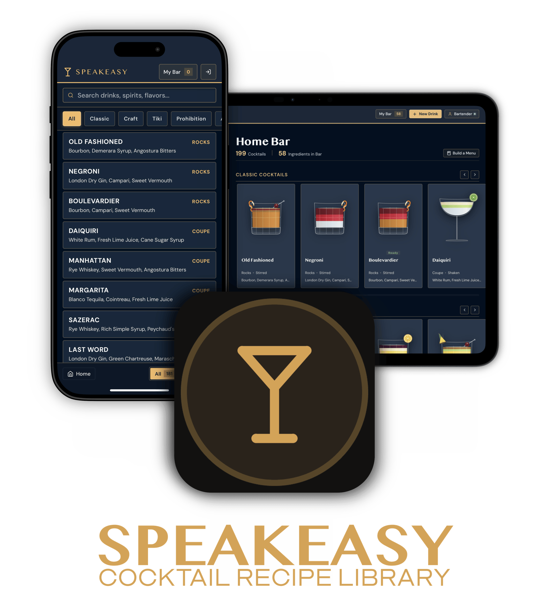
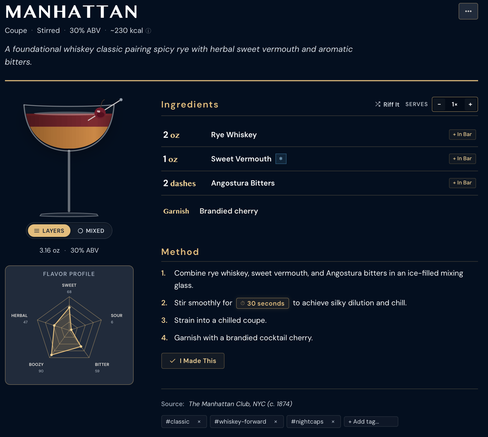
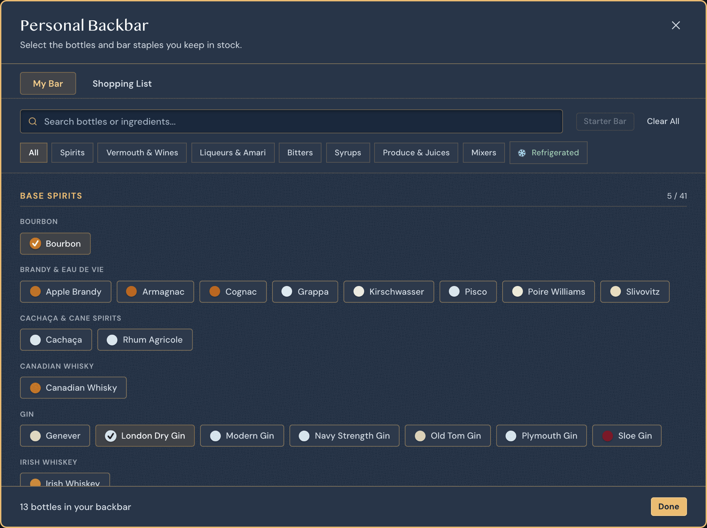
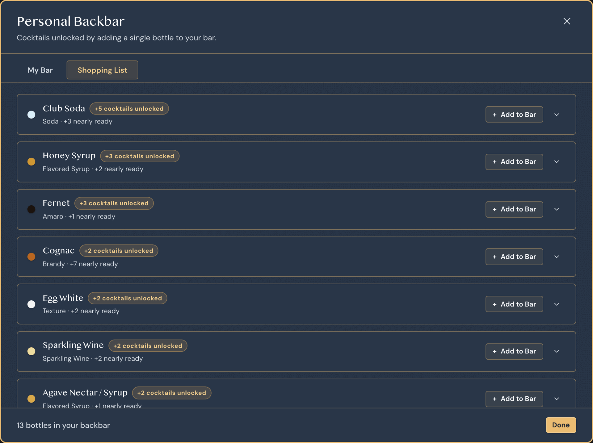
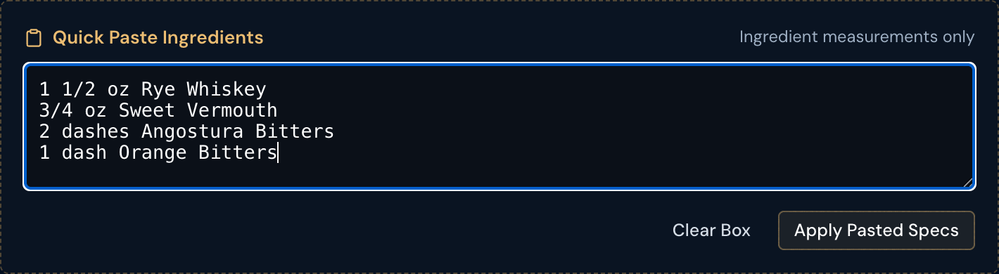
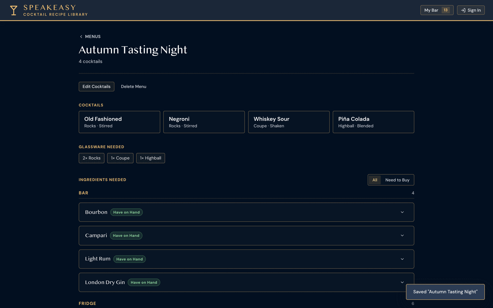
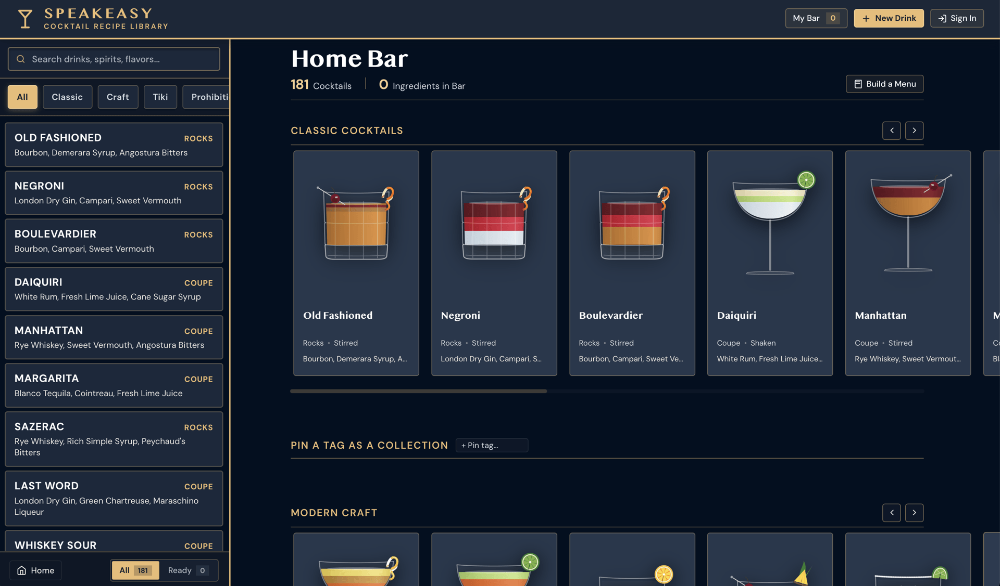

  

<h1 align="center">Speakeasy</h1>

<em>Cocktail library and bar companion.</em>

  <a href="https://speakeasy.ryanmarch.me"><strong>Try Speakeasy now → speakeasy.ryanmarch.me</strong></a>

  

Speakeasy is a cocktail recipe library built to live on your kitchen counter or bar cart. Browse 180+ recipes depicted as real glassware with fluid ingredient layers, track the bottles you actually own, and find out exactly what to pour or what to buy next.

## Features

### See the drink before you pour it
Every recipe renders inside its own glass — Coupes, Highballs, Rocks glasses, Nick & Noras, and even Tiki Mugs — with ingredients stacked as real fluid layers in proportion to the pour. Hover an ingredient to see its layer light up, or toggle to a blended view for shaken and stirred drinks that come out one uniform color. Garnishes land right where they belong: citrus wheels and twists on the rim, cherries and picks over the edge.

When recipes show how long to shake or stir, you'll see an inline button to immediately start a timer so you always get the perfect dilution. Drinks get their own flavor profile radar charts (sweet/sour/bitter/boozy) and are tagged with everything that makes them tick: bourbon, gin, smoky, tropical, you name it.

  

### Understand your bar ingredients
Check off the bottles you actually have: spirits, liqueurs, bitters, mixers. Speakeasy instantly shows which of its 180+ recipes you're ready to make. No guesswork, no digging through a recipe box to find out you're missing one ingredient.

  

### Find out what to buy next
Speakeasy quietly does the math on your shelf and surfaces the next bottles to expand your home bar by showing which cocktails each bottle unlocks. It's the best way to grow your home bar with intention.

  

### Riff, substitute, and explore
Out of Campari? Get a real substitution that keeps the drink balanced instead of ruining it. Find your next favorite drink through flavor-profile matching. If you make a riff on an existing cocktail, you can see how it compares to the original.

### Lightning-fast recipe creation
Find a recipe on a blog, in a book, or scrawled on a napkin and paste the ingredient list in. Speakeasy parses amounts, fractions, and units automatically, then guesses the glass, method, and garnish for you.

  

### Plan the whole night's menu
Building a menu for a party? Pick a handful of cocktails and Speakeasy tallies every bottle and every glass you'll need across the whole lineup, sorted into what's already on your shelf and what you still need to grab.

  

### Private and yours wherever you go
Everything works in your browser, and even better when added to your home screen. Sign in to sync your bar and custom recipes across every device, keep separate setups for a home bar and an office bar, log the drinks you've made, and share a link to any creation you're proud of. Back up your whole library anytime with one export.

  

### The little things

- Switch from ounces to milliliters at any time
- Keep the recipe screen awake while you're prepping ingredients
- View and add recipe histories to understand their origins
- Get ingredient substitutions suggestions based on what you have in stock
- Search by _anything_ including flavor profiles, ingredients, or glassware types
- Get kcal estimates for recipes
- Easily scale recipe servings up or down
- Includes all kinds of garnishes: citrus twists, peels, wheels, olives, sugar rims, and more
- Share a link to a recipe so friends can make it at home
- User guides included to answer common questions
- Watch your mixologist rank grow as you explore the world of cocktails

## How it's built

Speakeasy is built with plain HTML, modern CSS, and vanilla JavaScript — no frameworks, no build step, no external runtime dependencies. Every glass, every fluid layer, and every garnish is drawn as live vector art rather than a static image, which is what lets it react instantly as you tweak a recipe or swap a bottle.

## Disclaimer

Speakeasy is intended solely for individuals of legal drinking age in their respective jurisdiction (21 years of age or older in the United States). 

Calculations for dilution, ABV, and proof are mathematical estimates and should never be used as a measure of physical impairment, blood alcohol concentration, or fitness to operate motor vehicles or heavy machinery. Recipes, serving sizes, and other suggestions are for informational purposes only and do not constitute medical or professional advice. Always drink responsibly.

---

© 2026 Ryan March · <a href="https://ryanmarch.me">ryanmarch.me</a>

